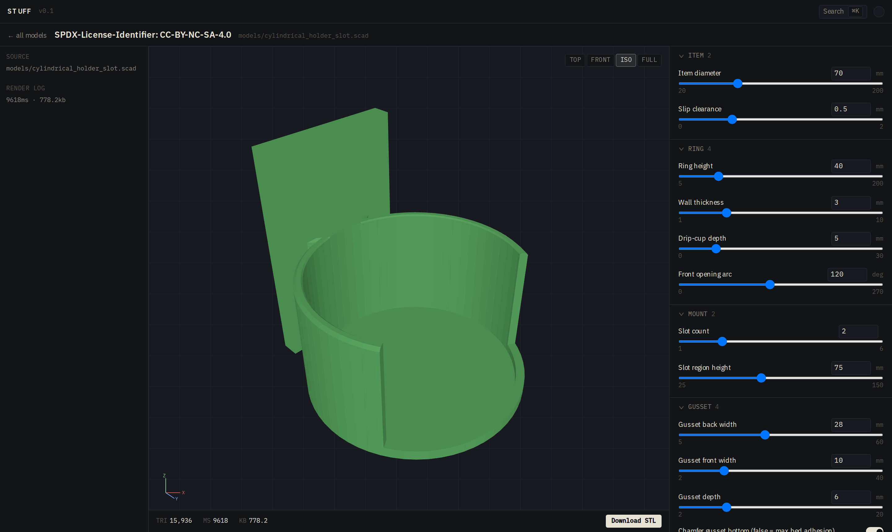

# stuff

An experiment in authoring parametric 3D-printable designs with
[Claude Code](https://claude.com/claude-code). Models are written as
single-file OpenSCAD parametric designs (on top of
[BOSL2](https://github.com/BelfrySCAD/BOSL2) and
[QuackWorks](https://github.com/AndyLevesque/QuackWorks)); a Next.js
+ WASM web UI exposes every model with live sliders, a browser
preview, and STL export. The interesting part isn't the models
themselves — it's the authoring loop.

**Live:** [stuff.seanoc.com](https://stuff.seanoc.com)

## Models

Everything under `models/` is a single-file parametric design. Pop one
open in OpenSCAD, or visit its page in the web app (see below) to
twiddle sliders and grab a fresh STL.

| File | Description |
| --- | --- |
| `cylindrical_holder_slot.scad` | Multiboard-mounted parametric holder for any cylindrical item (42–77 mm tested), Multiconnect slot backer. Consolidates four earlier fixed-diameter variants. |
| `popcorn_kernel.scad` | Cartoonish popped popcorn kernel — replacement piece for a Disney toddler-toy popcorn stand. Solid union of overlapping spheres, flat-cut base. |
| `spraycan_carrier_6x50mm.scad` | 2×3 spray-can tote carrier for 50 mm cans: six open-front C-ring cradles on a drainage base plate with a semicircular-arched handle. Kid-safe, wet-safe, tall-can (195 mm) clearance. |

## Authoring a new model

The loop, end to end: describe the part to Claude Code ("parametric
holder for X, fits Y range, mounts to Z"); Claude writes the `.scad`,
annotates each `@param`, seeds a `<stem>.invariants.py` sidecar, adds
an entry to `lib/models/catalog.ts`, and renders thumbnails; push;
CI regenerates thumbnails, runs the invariants gate, and ships to
Vercel. Open the model's page on the live site to tweak sliders and
download an STL.

A minimal first prompt worth copy-pasting:

> *Add a new model: a parametric wall-mounted hook for hanging a bike
> helmet. Parameters: hook diameter (30–80 mm), mount plate size,
> Multiboard backer. Annotate with `@param`, add an invariants
> sidecar, add a catalog entry, render thumbnails.*

Claude Code handles the `@param` grammar, the per-model invariants
sidecar (watertight / bbox / single-body claims), the catalog-join
entry, and the render pipeline without hand-holding. See
[AGENTS.md](AGENTS.md) for the agent-facing spec (param grammar,
invariants, render pipeline).

## Web app

Deployed at **[stuff.seanoc.com](https://stuff.seanoc.com)**.



*The model detail page: 3D preview in the middle, render log + source
info on the left, grouped parameter rail on the right. Every slider
re-renders the STL in the browser via `openscad-wasm-prebuilt`.*

`app/` is a Next.js App Router frontend that exposes every model as a
live parametric page: sliders for each `@param`, in-browser WASM
render driving a three.js preview, and a server-side STL export for
download. See [`app/README.md`](app/README.md) for architecture, the
`@param` annotation grammar, and the deploy flow.

## Libraries

`libs/` vendors the two OpenSCAD libraries the models depend on —
BOSL2 and QuackWorks — both pinned to specific commits that keep the
two compatible (newer BOSL2 commits break QuackWorks' vector-spin
syntax). See [`libs/README.md`](libs/README.md) for the exact pins
and the clone procedure.

## Development

After cloning, run once to enable the repo's git hooks:

```bash
./scripts/setup-git-hooks.sh
```

This points `core.hooksPath` at `.githooks/`, which currently ships a
`prepare-commit-msg` hook that appends the Claude Code attribution
trailer to every authored commit (matching the "Built with Claude
Code" note below). Idempotent — `--amend` and re-commits don't
duplicate the trailer.

Render a model directly via OpenSCAD (Manifold backend required; CGAL
OOMs on BOSL2):

```bash
openscad --backend Manifold -o out.stl models/cylindrical_holder_slot.scad
```

Run the web app locally (Next.js project is rooted at the repo root;
`app/` holds routes + the user-facing README):

```bash
npm install
npm run dev          # http://localhost:3000
```

`app/README.md` has the full picture, including the Playwright e2e
suite and the Vercel deploy flow.

## Continuous integration

Every push and pull request runs: render-thumbnail regeneration (when
`models/**` or the scad-render skill changes), per-model invariants
(watertight, single-body, triangle ceiling, `PRINT_ANCHOR_BBOX`
drift), Playwright end-to-end tests, and vitest unit tests.
Thumbnails and invariants are mandatory gates — a PR that breaks
either blocks merge. See [`docs/ci.md`](docs/ci.md) for the full
pipeline, file-change triggers, and local reproduction commands.

## License

- **Code** (Next.js app, TypeScript + Python tooling) — [MIT](LICENSE).
- **Models** (`models/*.scad`) — [](https://creativecommons.org/licenses/by-nc-sa/4.0/)
  (see also [`models/LICENSE`](models/LICENSE))
- Bundled OpenSCAD libraries retain their own licenses:
  [`libs/BOSL2/LICENSE`](libs/BOSL2/LICENSE) (BSD-2-Clause) and
  [`libs/QuackWorks/LICENSE`](libs/QuackWorks/LICENSE) (CC BY-NC-SA 4.0).

---

*Built with [Claude Code](https://claude.com/claude-code) using a
multi-agent authoring workflow.*
