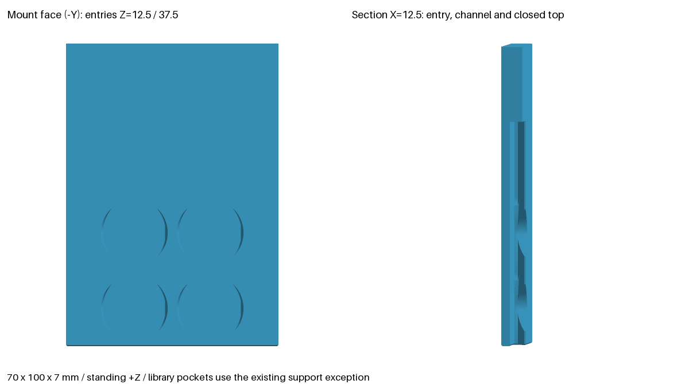

# Multibuild compatibility library

`multibuild/` is a thin adapter over the pinned `opengrid` Multiconnect
cutters (`eea2b4154a10d2909e5edece567cbe0563aaf955`). It ships our own
compatibility code and demo geometry; no official tile or connector assets
are bundled. Source attribution and the publication/licence caveats are in
[research §1](multibuild-research.md#1-system-names-catalogue-and-publication).

## API and mounting datum

```python
from multibuild import slot_cutter, SmallHoleConePin
from multibuild.constants import large_hole_center, small_hole_center

negative = slot_cutter(25, snap=True)
alignment_pin = SmallHoleConePin(fit_per_side=0, tip_diameter=1.8, half_angle=45)
```

`slot_cutter(travel=25, *, snap=False)` accepts positive multiples of 25 mm.
Travel is injected through a `Slot` factory; no dependency globals change.
All head geometry and cutter allowances stay pinned: radii 10/7.5 mm,
axial heights 1+2.5+0.5 mm, radial allowance 0.15 mm, full slot width allowance
0.3 mm, axial corrections +0.212132034/−0.062132034 mm, depth 4.15 mm.
The no-snap form retains the library's paired round seat cutters.

**Datum:** the consumer's back face is Y=0, material is at +Y, and the
negative extends from Y=0 to Y=4.15. The seated head's library transform is
`Pos(x, 4.15, seat_z) * Rot(90, 0, 0)`. The consumer slides **down** onto
flush heads: in the consumer frame the heads enter along +Z from below the
open ends. The seat is above the opening. Standoff is zero. Sean selected
flush connectors threaded into the large holes and offset snap wall mounts;
no extra wall-clearance provision or anti-lift trial is required by this task.
The research's earlier open connector/retention questions are superseded by
those decisions (2026-09-28); the mount contract tests normal pull-off capture,
not release force or load capacity.

Mounts declare `multibuild-multiconnect-slot` and provide
`mount_fixtures(mount_type, values) -> MountFixtures` with cutters, head seat
locations, face normal `(0,-1,0)` and entry axis `(0,0,1)`. Every production
preset inherits insertion, seating and capture checks. See
`multibuild/demo_plate.py` for a minimal example.

`SmallHoleConePin` is optional alignment geometry, independent of the cup-lid
fixture. Positive fit means **interference per side**: base diameter is
7.5 + 2×fit. Fit is −0.3…+0.3 mm, half-angle 30…60°, and the positive tip
must be smaller than the base. Length is `(base-tip)/(2*tan(half_angle))`.
Base is at Z=0, tip at +Z. The conservative cavity inequality includes
2×fit; it does not claim the pin clears the unexpanded mouth with positive
interference. Consumers must choose a printable tip (at least 1.8 mm) and
validate physical fit.

## Regenerated tile

`multibuild.tile.tile(cells=(2, 2)) -> Part` builds a MultiBuild tile from
**measured** values (`TILE_PROFILE`, every entry [V]). The corner is at the
origin and the tile spans Z = 0..6.2. Large octagon holes sit at the cell
centres, and small holes at the interior lattice points. It is an envelope
fixture for installed-part review renders: bores are at the thread minor
diameters, with no helices or edge teeth, and it is not a registered model.
It is a remix under the Multiboard Licence, **not MIT**
([LICENSE-MULTIBOARD.md](../multibuild/LICENSE-MULTIBOARD.md)).

## Provenance

[V] measured from an official file (committed artefact under
`reference/measured/`) or a physical print; [C] cited claim, including
another project's source and arithmetic on cited numbers; [U] unresolved.
The rule is [design-guidelines §7](design-guidelines.md#7-provenance), and
[provenance.md](provenance.md) lists the measured artefacts and deltas.
[C] source keys resolve in
[research §2–3](multibuild-research.md#2-board-dimensions-and-seam-rules).
`constants.PROVENANCE` accompanies every scalar; `LARGE_HOLE_PROFILE`
contains value/status/source/locator records for each field. A [V] locator is
the measurement JSON. A cited value that a measurement contradicts stays
unchanged and [C], with a `# measured` comment and a follow-up bead.

| Primitive | Value (mm) | Status and source locator |
| --- | --- | --- |
| Grid pitch | 25 | [V] `mb-large-octagon-hole-positive.json` |
| Tile thickness | 6.4 | [C] SCAD L56–61; measured 6.2 → pst-rs70f |
| Small mouth / throat / band | 7.5 / 6 / 2.9 | throat [V] `mb-small-thread-negative.json`; mouth, band [C] SCAD L96–104,237–265; measured 8.0 / 4.2 → pst-az4hh, pst-hav1h |
| Taper depth per face | 1.75 | [C] arithmetic (6.4−2.9)/2, SCAD L270–280; measured 1.0 → pst-3spc5 |
| Large octagon mouth / central flats, band | 23.4 / 21.4, 2.4 | flats [V] `mb-multihole-negative.json`; band [C] SCAD L68–83,218–224,270–280, measured 2.2 → pst-kooqt |
| Large helix outer / inner diameter | 22.6 / 21.4 | inner [V] `mb-multihole-negative.json`; outer [C] SCAD L85–94,228–233, measured 22.5 → pst-23uzq |
| Helix outer / inner axial width, pitch | 0.5 / 1.583, 2.5 | 0.5 and 2.5 [V] `mb-multihole-negative.json`; 1.583 [C] SCAD L85–94,228–233, measured 1.6 → pst-x5vo8 |
| Large grid phase | (25i+12.5, 25j+12.5) | [V] `mb-large-octagon-hole-positive.json` + `mb-small-thread-hole-positive.json` |
| Small grid phase, where holes exist | (25i+25, 25j+25) | [V] same files |
| Head and cutter allowances above | pinned Python implementation | [V] equal to the official v2 files, `mc-v2-round*.json`, `mc-v2-slot-negative.json`; Python constants L11–15; multiconnect L62–108,188–254 |
| Small-hole thread (not implemented) | pitch 3, outer/inner Ø7/6, axial widths 0.77/2.5 | Ø7/6 and 2.5 [V] `mb-small-thread-negative.json`; pitch and 0.77 [C] SCAD L100–104,257–265, measured 3.125 / 0.625 → pst-gvdrx, pst-5lum5 |
| Tile edges | Core teeth on two sides, side on one, corner on neither; tooth-side size cells×25+8 | [C] SCAD README, Usage / Tile Stack Sizing |
| Joining and wall offset | Dual Snaps; offset snap mounts 6.25 | [C] Mounting L46–50; Core §2.2 L88 |
| Installed seam clearance | no global allowance established | [U] Mounting steps/images; Core connections |
| Snap seat details | head spacing 0.795, triangle base 8, inset 0.6 | [C] Python multiconnect L260–332; spacing is not board pitch |
| Official head equality | head and negative equal the v2 modelling files | [V] `mc-v2-*.json` (research §3) |
| Production thread fit | unqualified | [U] research §2–3 |
| Fix-Point variants | Regular mates with hole; Lite with Rail and is 1 mm thinner | [C] Core §11 L238–251 |
| Fix-Point profile / release force | not established | [U] Core §11; sliding removal alone proves no force threshold |

The board records describe a reconstructed **female** hole. Octagonal flats
are not circular thread diameters. `LargeHoleThreadCutter` raises
`NotImplementedError` pending a qualified male/female thread specification;
`FixPointCutter` raises because Multiconnect was selected and Fix-Point's
profile is unresolved. See [research §5](multibuild-research.md).

## Demo and verification

The unregistered 70×100×7 mm plate has two snap slots at x=±12.5, seat Z=24,
with 25 mm channels opening through its bottom. It stands on Z=0, with
0.4 mm 45° relief on all bed edges, including the apertures. Finite wedges
and conical corner joins construct the relief because OCCT's general
chamfer operation fails at the short slot-lip edges. The library pocket
profile above that first-layer relief remains unchanged.

Backing is 7−4.15 = **2.85 mm** (minimum 2.4). Volume before: **N/A (new
artifact)**; final: **44,255.325 mm³**. Thickness is set by the backing rule.
This test artifact has no service-load rating or fused load-bearing joint.
It changes no manifest, baked STL, thumbnail or gallery entry.

Run `uv run --project build123d pytest build123d/tests/test_multibuild.py`.
Tests cover provenance, pin containment at 0.05 mm steps, profile and
allowance drift, watertightness, simultaneous insertion, normal capture,
and the production print audit. **Only the Multiconnect slot pockets** may
require supports in the standing orientation (Sean's accepted exception).
The rest passes the PLA/PCTG audit; the bed relief remains mandatory.

## Continuous channel with on-ramps

`channel_cutter(length, *, onramps, seats, drop=PITCH/2)` makes one continuous
T-channel negative from the pinned library primitives. Tall plates need heads
engaged at multiple board rows: a short bottom-entry slot leaves the upper plate
unsupported. The short `slot_cutter` API and registered holders are unchanged.

The channel uses **Z=0 at its lower end**, with the spine spanning `0..length`.
This differs from the short slot's seat-at-zero, negative-Z travel. X is across
the plate; the back face is Y=0, material +Y. Place it with
`Pos(x, 0, z_bottom)`. Heads enter along +Y at an on-ramp, then move +Z as the
consumer drops. The head pose remains `Pos(x, POCKET_DEPTH, z)*Rot(90,0,0)`.

```python
from multibuild import channel_cutter
negative = channel_cutter(75, onramps=(12.5, 37.5), seats=(25, 50))
```

Length must be a positive multiple of 25 mm. Positions are caller-supplied
absolute centres, with no implicit phase or pitch generation. Full openings
and snap exclusions must lie strictly inside the spine; centres at either end
are invalid. On-ramps are at least 25 mm apart. Each seat equals one on-ramp
plus `drop`, with **0 < drop < 25 mm**. Duplicate seats are invalid. Empty
sequences permit a plain spine for cross-section checks. Consumers supply at
least 2.4 mm backing and close the top with material; an unseated head must
hit that cap instead of riding out upward.

### Channel provenance

The primary authority remains David D's official
[v2 modelling files](https://www.printables.com/model/1008622-multiconnect-for-multiboard-v2-modeling-files).
Direct retrieval failed during this implementation; no official STEP equality
or physical fit is claimed. The secondary reference is the parametric
Multiconnect back used by Underware in QuackWorks, pinned at
`e0c1cb7ec78dd9e9a8476ed739bd3402074354f3`:
[Underware_Hooks.scad](https://github.com/AndyLevesque/QuackWorks/blob/e0c1cb7ec78dd9e9a8476ed739bd3402074354f3/Underware/Underware_Hooks.scad)
and [multiconnectSlotDesign.scad](https://github.com/AndyLevesque/QuackWorks/blob/e0c1cb7ec78dd9e9a8476ed739bd3402074354f3/Modules/multiconnectSlotDesign.scad).
These are dimensional references only; no SCAD geometry is ported or bundled.
The bead calls this the BlackjackDuck library; that attribution was not
established from these files (the Underware header credits Xavier Detant,
David D and Dontic), so author identity remains [U].

| Value / decision | Status and exact source locator |
| --- | --- |
| On-ramp spacing 25 mm | [V] `multiconnectSlotDesign.scad` L12,24,92–95: `distanceBetweenSlots=25`, `onRampEveryXSlots=1`, centre at `-y*distanceBetweenSlots` |
| Half-pitch phase / default drop 12.5 mm | [V] `Underware_Hooks.scad` L73–74,319,362–366: `onRampHalfOffset=true`, `distanceOffset=distanceBetweenSlots/2`, centre `-y*distanceBetweenSlots+distanceOffset` relative to the upper seat |
| Repeat snap seats on every selected board row | [U] explicit pst-iftb rev 2 requirement; secondary source has one upper snap seat and repeated entries, not proof of this exact repeated-seat assembly |
| Snap/dimple distinction | [V] `Underware_Hooks.scad` L339–357 v2 side triangles gated by `slotQuickRelease`; L368–374 v1 central dimple. This adapter uses the pinned Python v2 snap geometry, not a v1 dimple |
| Exact snap placement | [V] pinned Python `SnapInSlotCutter`, `multiconnect.py` L260–330: triangle offset 0.795, base 8, inset 0.6; paired head centres 0 and −0.795. Translated relative to each seat, without scaling |
| Profile and allowance | [V] pinned Python `SlotCutter` L225–258: 20/15 widths with +0.3 allowance; 1+2.5+0.5 heights with the existing axial allowances. `RoundHeadCutter` fixes `POCKET_DEPTH=4.15` |
| On-ramp shape | [V] pinned Python `SlotOpeningCutter` L335–375: radii 10.15/11, depth 4.15. Retained unchanged; secondary SCAD frustum dimensions are not substituted |
| Official profile/phase/dimple equality | [U] official v2 files unavailable; defaults above are implementation/source evidence, not measured official geometry |

The snap exclusions are the difference between library `SlotCutter` and
`SnapInSlotCutter`. Subtracting that difference from the spine retains the
snap material; adding a snap cutter to a full spine would erase it. The
on-ramp unions trim these exclusions wherever the library openings overlap.
Booleans run in the native library frame before one final rotation. The demo
places two copies of one constructed cutter, preserving common curved-edge
geometry for consistent STL tessellation; it does not rebuild each instance.

### Demo, material and verification

`demo_plate.channel_plate()` is unregistered: 70 X × 100 Z × 7 Y mm, channels
at x=±12.5, spine Z=0..75, on-ramps Z=12.5/37.5, seats Z=25/50, drop 12.5.
Z=62.5 is deliberately not an entry. The plate closes the spine with 25 mm
above it; four heads engage simultaneously. All bed-contact edges have the
existing 0.4 mm relief. Other outer edge treatment follows the existing demo;
this is an unregistered mounting test coupon with no service-load rating.

| Geometry | Before → after volume (mm³) | Material reason |
| --- | --- | --- |
| Channel demo | N/A (new part) → 37,197.459 | Explicit 7 mm plate leaves 2.85 mm backing behind the 4.15 mm pocket; no extra rear slab |
| Existing slot demo | 44,255.325 → 44,255.325 | Unchanged geometry |

The bead's `7 = POCKET_DEPTH + 2.4` arithmetic is inconsistent with the pinned
4.15 mm pocket. The demo preserves its explicit 7 mm dimension and exceeds the
2.4 mm minimum by 0.45 mm; it does not redefine `POCKET_DEPTH`.

`multibuild-multiconnect-channel` fixtures provide channel cutters, seats and
corresponding `onramp_locs` (head poses, one per seat). Its contract reuses
seat clearance, normal capture and depth-profile checks, then samples entry
along +Y and travel along +Z at ≤0.5 mm intervals, including endpoints. It
also samples the full 12.5..50 mm span and checks actual top material. Backing
is checked by extruding each pocket-back face 2.4 mm into the consumer and
requiring that entire local volume to be solid, covering the spine, on-ramp
and seat regions. Only the first 0.5 mm at the bed is excluded for edge
relief. Deliberately sealed entries, blocked channels, open caps and 1 mm
local backing (despite an unchanged 7 mm overall depth) fail.
This verifies geometry, not release force, creep or loaded physical retention.

The production print audit passes with the existing library-pocket exception:
45° maximum non-exempt overhang, 0 mm bridge, 2.85 mm minimum wall, no downward
fillets, bed chamfer present. Standing +Z in PLA/PCTG uses the same pocket
exception as the short slot; there is no new support exception.



Regenerate the render and audit with
`uv run --project build123d python build123d/scripts/render_channel_plate.py`.
Run geometry and regression checks with
`uv run --project build123d pytest build123d/tests/test_multibuild.py`.
