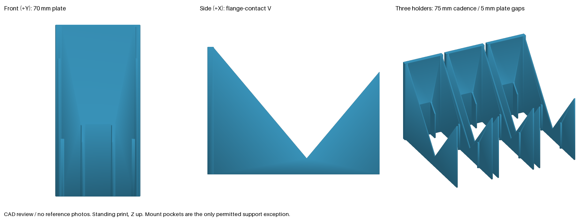

# Spool cradle validation — pst-ir0v

One spool per holder, with its axis parallel to the wall. X is the spool
axis, +Y faces the user, and +Z is up. Print standing on Z=0. The two
flanges bear on four tangent contact lines; the winding is clear.

## Dimensions and provenance

| Input | Defaults / domain | Evidence |
| --- | --- | --- |
| Spool diameter | 200; 190–205 mm | The [Bambu AMS 2 Pro specification](https://eu.store.bambulab.com/en-ch/products/ams-2-pro) gives 197–202 mm compatibility. The wider model range includes this interval. |
| Spool width | 66; 50–70 mm | The same first-party specification gives 50–68 mm. The Bambu preset uses 67 mm; the generic preset uses the bead's nominal 66 mm. |
| Bambu reusable envelope | Ø200 × 67 mm | [Bambu's reusable-spool listing](https://au.store.bambulab.com/products/bambu-reusable-spool) lists **packing size** 200 × 200 × 67 mm; [the community dimensional report](https://forum.bambulab.com/t/bambu-spool-dimensions/123480/2) separately reports an approximate Ø200 × 67 mm spool. This is nominal sizing, not a toleranced manufacturer drawing. |
| Flange height above full winding | 8; 4–15 mm | Operator-specified default in pst-ir0v canonical rev 5. No published full-winding diameter was established. Both presets explicitly retain 8 mm. |
| Axial flange rim land | 3; 1.5–6 mm | Operator-specified default in pst-ir0v canonical rev 5. No published rim-land measurement was established. Both presets explicitly retain 3 mm. |
| V half angle from vertical | 40°; 25–45° | Approved design domain. |
| Front rise above tangent contact | 5; 0–15 mm | Approved adjustable access gesture; 0 preserves the front tangent edge for lift-out. |
| Plate | 70 × 141.751 × 7 mm at defaults | Width 68–70; thickness 6.6–9 mm. Height follows the arm root. |
| Board pitch / cutter depth | 25 / 4.15 mm | [Pinned library and provenance](multibuild-library.md). |

Flange dimensions are **design inputs pending measurement**, not measurements
inferred from AMS compatibility. The clearance tests establish the result for
the declared envelope. Before printing for a particular spool, measure its
rim land and the radial difference between flange and full winding. The
physical print-check follow-up **pst-m9xt** must resolve these two preset assumptions.

## Geometry and clearance

For radius `R`, half angle `a`, plate thickness `t`, and wall clearance `c`:

- V apex: `(Y,Z) = (t+c+R, 18)`.
- Spool centre: `(t+c+R, 18+R/sin(a))`.
- Tangencies: `Y = centreY ± R*cos(a)`, `Z = centreZ − R*sin(a)`.
- Front termination: `frontY + lip_height*tan(a)`.
- Winding fixture: radius `R − flange_height`, axial length
  `spool_width − 2*flange_rim_width`.

Two 2.4 mm longitudinal webs follow the V. Their two transverse ribs per web are also
2.4 mm thick and stop 12 mm below the V plane. At a narrow plate/wide spool
combination, the root shifts inward over the first 12 mm of arm travel to leave a
2 mm plate-side margin for the exterior chamfers.
Every interface overlaps by a full 2.4 mm wall. Vertical R1 fillets blend
arm, rib and plate junctions. Two further 2.4 mm ribs reinforce the mount
region, projecting 15 mm from the plate with 45° top ramps.

Tests build every numeric endpoint and the combined wide-spool/narrow-plate
corner. They inspect all four contact lines on the finished solid, intersect
both flange fixtures with it, and measure separation from the winding
cylinder. They also check the projected spool centre stays at least 15% of
the footprint span from its boundaries. The rear spool envelope remains at
least 3 mm clear of the plate, including Ø205 mm.

## Mount and row spacing

Exactly two snap-in seats lie at X=−12.5/+12.5, Z=24. Each 25 mm entry
channel opens through the bottom. The production mount contract checks
aperture, profile, seating, capture and continuous entry for both heads.
The board contact plane is Y=0: no standoff is added.

The operator-approved §5 exception fixes count=2, travel=25 and snap-in
retention. Margin derives from the cutter envelope and plate width. Three
large-hole seats need a 70.30 mm envelope, which exceeds the 70 mm cap.
Presets describe spool families rather than mount-strength variants.

| Horizontal cadence | Plate gap at 70 mm width | Spool gap at 66 / 67 / 70 mm |
| --- | --- | --- |
| 75 mm (3 holes) | 5 mm | 9 / 8 / 5 mm |
| 100 mm (4 holes) | 30 mm | 34 / 33 / 30 mm |

The plate centre lies on a small-hole column. Tests place three finished
holders at each cadence and use the library's large/small-hole helpers to
verify both seat centres, common height and equal non-overlapping gaps.

Minimum vertical centre pitch is `spool_diameter + lip_height + 3 mm`
(3 mm handling margin). Round **up** to the next 25 mm board row:

| Spool | Lip 0 | Lip 5 (default) | Lip 15 | Grid pitch to use |
| --- | --- | --- | --- | --- |
| Ø200 | 203 | 208 | 218 mm | 225 mm |
| Ø205 | 208 | 213 | 223 mm | 225 mm |

This is spool access spacing. Empty the holder before sliding it off its
connectors; its mounting travel is separately fixed at 25 mm.

## Load calculation

Worst-case design load: **30 N downward at the front tangent line**.
This is 2.55 times a 1.2 kg spool's weight (using 9.81 m/s²).

Material basis: the [Prusament PETG TDS, v1.1, page 2](https://prusament.com/wp-content/uploads/2022/10/PETG_Prusament_TDS_2021_10_EN.pdf)
reports printed tensile yield of 47 ± 2 MPa horizontally and 50 ± 1 MPa in
its vertical-XZ specimen. Use **45 MPa**, the lower horizontal value, and
limit calculated stress to **15 MPa**. This basis requires a PETG/PCTG
material and print process capable of that yield; it is not a rating for
all products sold under those material names.

Sean's profile is three 0.4 mm walls with 15% gyroid/adaptive cubic. All
2.4 mm arm webs and ribs are counted as solid perimeter sections. The plate
calculation counts only its **1.2 mm shell**, with no infill contribution.
No hollow shell is modelled into the CAD. Check the sliced perimeters before
printing. PLA is excluded by the approved deviation: creep and heat under a
sustained cantilever load are unsuitable for this design basis.

### Arm root

Take a section at Y=t+2, beyond the R1 root fillet. Discard the mount ribs
from this calculation. A conservative rectangular core of each web is
2.4 × 137.567 mm, after a 0.8 mm allowance for edge relief:

```
S = 2 × b × h² / 6 = 15,139.768 mm³
M = 30 × (186.604 − 9) = 5,328.133 N mm
stress = M / S = 0.352 MPa < 15 MPa
```

The test computes area inertia from the final CAD section with OCP, pins
the resulting section modulus to 15,000–16,000 mm³ and verifies it exceeds
the rectangular-core value. The longitudinal bending stress runs along Y,
in the XY layer plane. The upright plate itself is in XZ; it is **not** in
the layer plane. Transverse shear and local connector stresses still need
the physical check.

### V waist

The waist is the arm's shallowest section and must be checked separately
from the tall root. Its 18 mm height leaves a conservative 17.2 mm core:

```
S = 2 × 2.4 × 17.2² / 6 = 236.672 mm³
worst M = 30 × 102.5 × cos(25°) = 2,786.897 N mm
worst stress = 11.775 MPa < 15 MPa
```

The final section test measures both waist widths and heights. Every
parameter endpoint checks this stress bound. Moving toward the front
reduces moment and increases section height; moving rearward increases
height fast enough that the waist controls.

### Pocketed plate at the seat row

A plain 7 mm plate did not meet the conservative shell calculation; the two
mount ribs are necessary. At Z=24, use these non-overlapping rectangles:

- Back skin: 1.2 mm deep, omit each entire 20.30 mm cutter-width envelope.
- Front skin: 1.2 mm deep. Inset both skin widths by 0.5 mm at either edge
  to omit corner chamfers.
- Side skins: 1.2 mm wide, between the front and back skins.
- Mount ribs: 2.4 × 14.5 mm each. Omit the final 0.5 mm bevel from inertia,
  but use the actual 15 mm tip when calculating extreme-fibre distance.

For each rectangle, `A=b*h`, `ȳ=Σ(A*y)/ΣA`, and
`I=Σ(b*h³/12 + A*(y−ȳ)²)`. Then `S=I/max(ȳ,t+15−ȳ)`.
The test proves every counted rectangle is contained in the final model.
Use the full wall-to-front-contact moment `M=30*frontY`:

| Case | S (mm³) | Stress (MPa) | Limit |
| --- | --- | --- | --- |
| Default | 448.208 | 12.490 | 15 |
| 68 mm plate, 6.6 mm thickness, Ø205, 6 mm wall clearance, 25° V | 428.159 | 14.574 | 15 |

These are elastic section checks, not FEA or a measured wall-attachment
rating. Board threads, connector retention, print quality, creep and bump
behaviour remain physical validation items.

## Print and edge audit

Standing print, Z=0 on the bed. Only the two registered Multiconnect cutter
pockets are excluded, under Sean's explicit support exception. No additional
geometry is excluded from the production print audit.

```
overhang: 45.0°; bridge: 0.0 mm; minimum sampled wall: 2.40 mm
 downward curved faces: 0; bed chamfer: present; PASS
```

| Final edge class | Treatment / reason |
| --- | --- |
| Plate top and outer vertical edges | 0.5 mm chamfer |
| Transverse rib outer edges and tops | 0.5 mm chamfer |
| Mount-rib outer edges and 45° ramp rims | 0.5 mm chamfer |
| Front lip top | 0.5 mm chamfer when rise ≥1 mm; smaller rises retain the functional tangent edge |
| Bed outline, including slot apertures | 0.4 mm 45° relief; aperture corners use conical joins |
| Arm/plate and rib/web vertical junctions | R1 fillets |
| Internal rib cap-to-web boundaries | Concave structural boundaries where cap chamfers terminate the vertical blends |
| Flange tangent surfaces / their edges | Functional, unchanged |
| Library slot profile | Functional, unchanged above the bed-edge relief |
| Tangent face boundaries | No sharp external edge |

The final-edge test checks all bed-edge neighbours for 45° relief and
classifies every edge of the finished solid. It rejects other untreated
90° exterior corners.

## CAD renders — no reference photos



[Default STL](exports/holder_spool_cradle.stl) ·
[Bambu preset STL](exports/holder_spool_cradle_bambu_reusable_200.stl) ·
[Generic AMS preset STL](exports/holder_spool_cradle_ams_generic_200.stl)

The image contains CAD geometry only. The three-holder row supplies the
alignment evidence; no reference photos were supplied.

## Material use

| Preset | Before | Final `part.volume` | Reason |
| --- | --- | --- | --- |
| `bambu_reusable_200` | N/A — new model | 134,709.073 mm³ | Perimeter webs and ribs carry the load; the two mount ribs make the pocketed shell section pass. |
| `ams_generic_200` | N/A — new model | 134,696.164 mm³ | The narrower spool needs less root flare; web sections and plate remain the same. |

The plate follows the root's required height and the approved 70 mm row
width. The webs are 2.4 mm solid sections, not bulky infill-backed slabs.

## Reproduce

From the repository root:

```sh
uv run --project build123d pytest build123d/tests/test_spool_cradle.py
uv run --project build123d python build123d/scripts/manifest.py
uv run --project build123d python build123d/scripts/render_spool_cradle.py
npm test
```

The model is registered for the normal manifest, STL/GLB export, preset bake,
mount contract and production print-audit pipelines.
